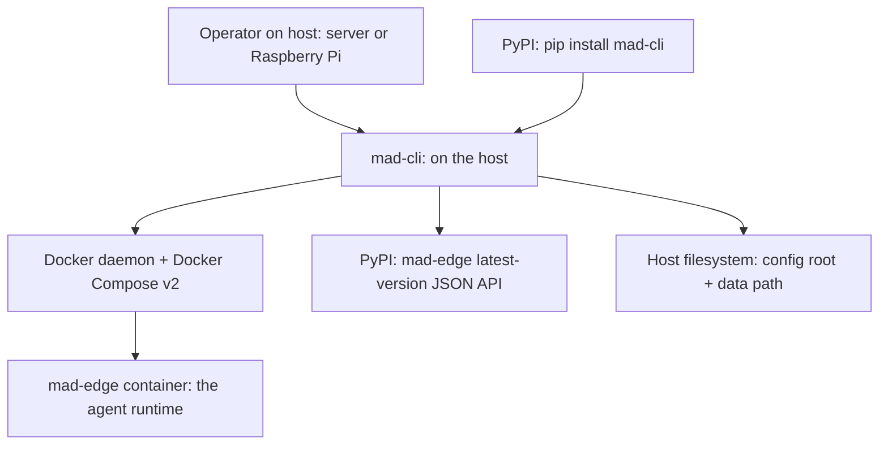

# Context

mad-cli sits on the operator's host. It is invoked from the command line, and it drives the Docker daemon to build and run the mad-edge container. It never enters the agent runtime loop — that loop belongs to mad-edge, which runs inside the container.

## Upstream (who invokes mad-cli)

- The operator, working on their host — a server or a Raspberry Pi.
- PyPI, from which mad-cli is installed with `pip install`.

## Downstream (what mad-cli drives)

- The Docker daemon and Docker Compose v2, shelled out as `docker compose -p mad-<name> -f compose.yml --env-file .env <verb>`.
- The mad-edge container it builds and runs.
- PyPI again, for the mad-edge latest-version lookup (JSON API).
- The host filesystem:
  - The config root `~/.config/mad` (override with `MAD_CLI_CONFIG_DIR`), holding `instances/<name>/`.
  - The data path (default `~/mad-data`), holding each instance's `workspaces/`, `claude/`, and `aws/` bind mounts.

mad-cli operates entirely on the host. It never enters the agent runtime loop; that is mad-edge's job, inside the container.
