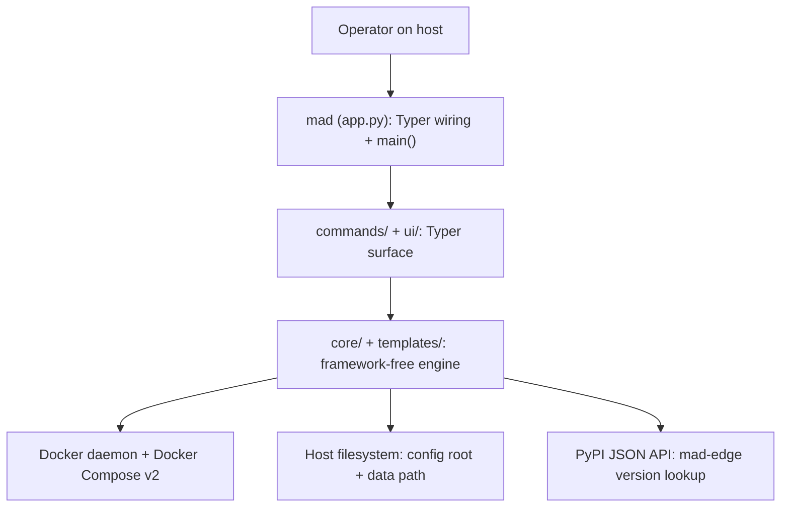

# Architecture Overview

mad-cli is a framework-free engine under a thin Typer/Rich surface. All of the real work — resolving instances, parsing `.env` files, rendering templates, shelling out to Docker, looking up versions on PyPI — lives in a plain-Python engine that never imports `typer` or `rich`. The command-line surface is a slim wrapper that parses arguments, calls into the engine, and prints results.

## The three layers

- **Engine (`mad_cli.core` + `mad_cli.templates`).** The framework-free core: config-root resolution, the tolerant `.env` parser, instance discovery, the key registry, Claude credential writing, template rendering, the Docker/Compose runner, Docker detection, and the PyPI version lookup. It is type-checked with `mypy --strict` and never imports `typer`/`rich`. `mad_cli.templates` holds the packaged `string.Template` sources for the container files.
- **Surface (`mad_cli.commands` + `mad_cli.ui`).** The Typer command modules and the shared UI helpers (one Rich `Console`, the step spinner, the prompt helpers). This layer never touches `subprocess` or the filesystem directly — it goes through the engine.
- **Wiring (`mad_cli.app`).** The Typer application assembly plus `main()`, the console-script entry point. It sets `no_args_is_help=True` and `add_completion=False`, and registers an eager `--version` that prints `mad_cli.__version__`.

## Layering rule

The engine/surface split is a hard boundary: `core`/`templates` must never import `typer`/`rich`, and `commands`/`ui` must never touch `subprocess` or the filesystem directly. See [../04-conventions/layering.md](../04-conventions/layering.md) for how the rule is defined and upheld.

## How a command flows

`mad <cmd>` runs the Typer surface, which resolves the target instance through `core.instance`, constructs a core object (a `ComposeRunner`, an `EnvFile`, or a `RenderContext`), and lets the core either shell out to Docker or write files. The surface then uses `ui` to print the result. Nothing in the surface reaches Docker or the filesystem on its own.

## The frozen seam

The core-to-commands integration seam — the module paths, names, and signatures the surface depends on — is frozen in `CONTRACTS.md` at the repo root. That file is the source of truth for the seam: those names, module paths, and signatures must not change without updating `CONTRACTS.md` in the same PR. This document references it rather than duplicating its signatures.

## Entry points

- **`mad`** — the console-script entry point, wired to `main()` in `mad_cli.app`.
- **`python -m mad_cli`** — the module entry point (`mad_cli.__main__`).

## See also

- [source-tree.md](source-tree.md) — the exact, CI-diffable file list of `src/mad_cli/`.
- [components.md](components.md) — the module-by-module responsibilities reference.
